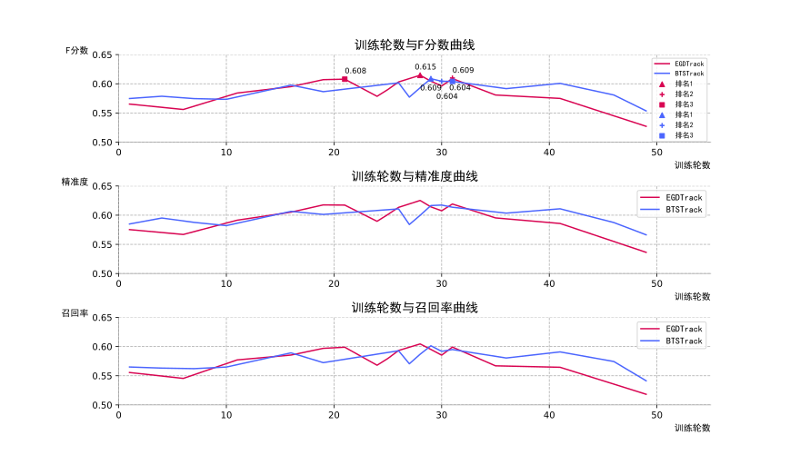

# EGDTrack  RGB+Depth多模态目标跟踪

本科毕业论文，采用边缘引导的单目深度估计网络EG-BTS，制作一个coco2017RGBD数据集，用于融合深度信息的多模态目标跟踪。并且在DepthTrack测试集上取的了很好的效果。  
开源以供学习，有任何问题欢迎联系

<!-- PROJECT SHIELDS -->

[![Contributors][contributors-shield]][contributors-url]
[![Forks][forks-shield]][forks-url]
[![Stargazers][stars-shield]][stars-url]
[![Issues][issues-shield]][issues-url]
[![MIT License][license-shield]][license-url]

[//]: # ([![LinkedIn][linkedin-shield]][linkedin-url])

[//]: # (<!-- PROJECT LOGO -->)

[//]: # (<br />)

[//]: # ()
[//]: # (<p align="center">)

[//]: # (  <a href="https://github.com/shaojintian/Best_README_template/">)

[//]: # (    )

[//]: # (  </a>)

[//]: # ()
[//]: # (  <h3 align="center">"完美的"README模板</h3>)

[//]: # (  <p align="center">)

[//]: # (    一个"完美的"README模板去快速开始你的项目！)

[//]: # (    <br />)

[//]: # (    <a href="https://github.com/shaojintian/Best_README_template"><strong>探索本项目的文档 »</strong></a>)

[//]: # (    <br />)

[//]: # (    <br />)

[//]: # (    <a href="https://github.com/shaojintian/Best_README_template">查看Demo</a>)

[//]: # (    ·)

[//]: # (    <a href="https://github.com/shaojintian/Best_README_template/issues">报告Bug</a>)

[//]: # (    ·)

[//]: # (    <a href="https://github.com/shaojintian/Best_README_template/issues">提出新特性</a>)

[//]: # (  </p>)


[//]: # ( 本篇README.md面向开发者)
 
本科毕业论文，代码将在5月份更新，soon

EGDTrack和DiMP在DepthTrack测试集上困难示例

EGDTrack在DepthTrack测试集上不同轮数的F分数结果展示


## 目录

- [上手指南](#上手指南)
  - [开发前的配置要求](#开发前的配置要求)
  - [安装步骤](#安装步骤)
- [文件目录说明](#文件目录说明)
- [部署](#部署)
- [使用到的框架](#使用到的框架)
- [版本控制](#版本控制)
- [作者](#作者)


### 上手指南


###### 开发前的配置要求

1. ubuntu20
2. python 3.7

###### **安装步骤**

1. 克隆仓库
2. 参考[README.md](Tracker%2FREADME.md)去安装环境，然后再参考[README.md](EG-BTS%2FREADME.md)环境


### 文件目录说明

``` 
├── LICENSE.txt
├── README.md
├── /dataset
│  ├── /data
│  │  ├── /nyu2_test
│  │  ├── /nyu2_train
│  │  ├── ......
│  ├── /depthtrack
│  │  ├── /test
│  │  └── /train
│  │  │  ├── /adapter02_indoor
│  │  │  │  ├── /color
│  │  │  │  ├── /depth
│  ├── /COCO
│  │  ├── /annotations
│  │  ├── /train2017
│  │  │  ├── /color
│  │  │  ├── /depth
├── /EG-BTS
├── /Track


```


### 使用到的框架

- [BTS](https://github.com/cleinc/bts) 
- [DeT](https://github.com/xiaozai/DeT)  


### 版本控制

该项目使用Git进行版本管理。您可以在repository参看当前可用版本。

### 作者
qq:2804006356      &ensp;email:2804006356@qq.com

### 版权说明

该项目签署了MIT 授权许可，详情请参阅 [LICENSE.txt](https://github.com/7yzx/EGDTrack/blob/master/LICENSE.txt)


<!-- links -->
[your-project-path]:7yzx/EGDTrack
[contributors-shield]: https://img.shields.io/github/contributors/7yzx/EGDTrack.svg
[contributors-url]: https://github.com/7yzx/EGDTrack/graphs/contributors
[forks-shield]: https://img.shields.io/github/forks/7yzx/EGDTrack.svg?style
[forks-url]: https://github.com/shaojintian/7yzx/EGDTrack/network/members
[stars-shield]: https://img.shields.io/github/stars/7yzx/EGDTrack.svg?style
[stars-url]: https://github.com/7yzx/EGDTrack/stargazers
[issues-shield]: https://img.shields.io/github/issues/7yzx/EGDTrack.svg?style=flat-square
[issues-url]: https://img.shields.io/github/issues/7yzx/EGDTrack.svg
[license-shield]: https://img.shields.io/github/license/7yzx/EGDTrack.svg?style=flat-square
[license-url]: https://github.com/7yzx/EGDTrack/blob/master/LICENSE.txt

[//]: # ([linkedin-shield]: https://img.shields.io/badge/-QQ-black.svg?style=flat-square&colorB=555)

[//]: # ([linkedin-url]: https://linkedin.com/in/shaojintian)


