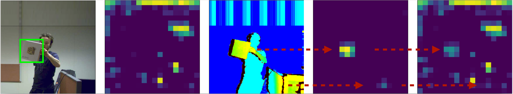
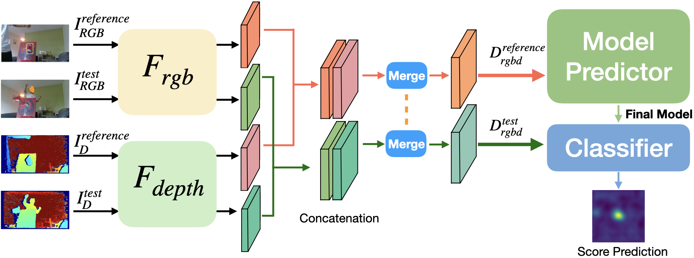
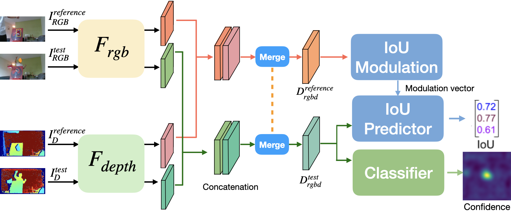

# EGDTrack

## 目录

- [安装](#安装)
  - [自己的安装历程](#我的历程)
- [测试结果](#测试)
- [部署](#部署)
- [使用到的框架](#使用到的框架)
- [版本控制](#版本控制)
- [作者](#作者)


并非完整版教程，需要根据pytracking的步骤做完
### 安装
**本实验最终在3080GPU上训练测试**  
```python3.7 cuda11.3.1 ubuntu20```  
参考了
[pytracking系列跟踪算法的配置（LWL, KYS, PrDiMP, DiMP and ATOM Trackers）（Ubuntu版本）](https://blog.csdn.net/qq_17783559/article/details/117933369)  
[pytracking框架 服务器端配置采坑（ubuntu18.04+cuda11.3）](https://blog.csdn.net/qqsuiying/article/details/121593987#:~:text=pytracking%E6%A1%86%E6%9E%B6%20%E6%9C%8D%E5%8A%A1%E5%99%A8%E7%AB%AF%E9%85%8D%E7%BD%AE%E9%87%87%E5%9D%91%EF%BC%88ubuntu18.04%2Bcuda11.3%EF%BC%89%201%201.%20Create%20and%20activate%20a,environment%20...%205%205.%20Download%20the%20pre-trained%20networks)  
遇到的一些问题可以看这个解决
[pytracking安装及运行3090Ubuntu18+cuda11（1）](https://blog.csdn.net/weixin_43392132/article/details/123744880)  
也可以直接看官方安装历程最重要就是选择一个很是的pytorch版本


### 我的历程
首先我直接虚拟环境安装了torch1.10版本的，但是有问题的。出现要设置CUDAHOME当时不明白
https://blog.csdn.net/qq_41166909/article/details/124243523   这里面说明了所以需要手动安装一下，我先尝试了cuda11.3
失败，也没有找方法。
1. 目前的pytracking环境的配置
conda 环境安装mamba install pytorch==1.10.1 torchvision==0.11.2 torchaudio==0.10.1 cudatoolkit=11.3 -c pytorch -c conda-forge
电脑上无法用好
我手动安装11.3 失败
错误：
    raise RuntimeError(message) from e
RuntimeError: Error building extension '_prroi_pooling'

2. tracking_de 配置
现在使用cuda10看看
 mamba install pytorch==1.6.0 torchvision==0.7.0 cudatoolkit=10.2 -c pytorch
手动安装cuda10.0成功
3. 后面还是出现了问题，但是看这个
[pytracking安装及运行3090Ubuntu18+cuda11（1）](https://blog.csdn.net/weixin_43392132/article/details/123744880)  
export CUDA_HOME=/usr/local/cuda

## 测试运行
### pytracking test
```bash
export CUDA_HOME=/usr/local/cuda
# 1. 终端不一定需要
python -m visdom.server
# 2. 另一个
python pytracking/run_tracker.py atom default --dataset_name otb --sequence Soccer --debug 1 --threads 0
```

## 测试
### 数据集下载DepthTrack测试集
数据集来于[DeT](https://github.com/xiaozai/DeT)
#### DepthTrack Test set (50 Sequences) 
[Download](https://doi.org/10.5281/zenodo.5792146)

#### DepthTrack Training set (152 Sequences)
[Download (100 seqs)](https://doi.org/10.5281/zenodo.5794115),  [Download (52 seqs)](https://doi.org/10.5281/zenodo.5837926)

All videoes are 640x360, except 4 sequences in 640x320: painting_indoor_320, pine02_wild_320, toy07_indoor_320 (**some gt missing**), hat02_indoor_320

还可以测试CDTB。目前只做了两个  
VOT-test
1. `vot initialize --workspace . --nodownload`
2. 最好直接把test命名为sequence然后下一级才是各类图片
```
   rm -rf sequences
   sudo ln -s /path/to/datasettest/sequences ./
   ``` 
3. `vot analysis --workapce . mycocoDeT_DiMP50_Mean_78 --format html`
or --format json

### Monocular Depth Estimation 
使用尝试的EG-BTS（coco2017数据集）


### Train
Using the default DiMP50 or ATOM pretrained checkpoints can reduce the training time.

For example, move the default dimp50.pth into the checkpoints folder and rename as DiMPNet_Det_EP0050.pth.tar

```
cd ltr
python run_training.py bbreg DeT_ATOM_Max
python run_training.py bbreg DeT_ATOM_Mean
python run_training.py bbreg DeT_ATOM_MC

python run_training.py dimp DeT_DiMP50_Max
python run_training.py dimp DeT_DiMP50_Mean
python run_training.py dimp DeT_DiMP50_MC
```

### Test
/pytracking中有两个脚本分别测试CDTB和DepthTrack，参考
```
cd pytracking
python run_tracker.py atom DeT_ATOM_Max --dataset_name depthtrack --input_dtype rgbcolormap
python run_tracker.py atom DeT_ATOM_Mean --dataset_name depthtrack --input_dtype rgbcolormap
python run_tracker.py atom DeT_ATOM_MC --dataset_name depthtrack --input_dtype rgbcolormap

python run_tracker.py dimp DeT_DiMP50_Max --dataset_name depthtrack --input_dtype rgbcolormap
python run_tracker.py dimp DeT_DiMP50_Mean --dataset_name depthtrack --input_dtype rgbcolormap
python run_tracker.py dimp DeT_DiMP50_MC --dataset_name depthtrack --input_dtype rgbcolormap
python run_tracker.py dimp DeT_DiMP50_DO --dataset_name depthtrack --input_dtype colormap


python run_tracker.py dimp dimp50 --dataset_name depthtrack --input_dtype color
python run_tracker.py atom default --dataset_name depthtrack --input_dtype color

```


### Architecture
The settings are same as that of Pytracking, please read the document of Pytracking for details.

Actually the network architecture is very simple, just adding one ResNet50 feature extractor for Depth input and then merging the RGB and Depth feature maps.
Below figures are
1) the feature maps for RGB, D inputs and the merged RGBD ones,
2) the network for RGBD DiMP50, and
3) RGBD ATOM.






### Download
1) Download the training dataset and edit the path in local.py

2) Download the checkpoints for DeT trackers (in install.sh)

The checkpoints (don't edit it :):
```
https://drive.google.com/drive/folders/1DHDVhGHYYhoI9mjmgVUoautQe11SIKHL?usp=sharing
```

These links do not work now ! 
```
gdown https://drive.google.com/uc\?id\=1djSx6YIRmuy3WFjt9k9ZfI8q343I7Y75 -O pytracking/networks/DeT_DiMP50_Max.pth
gdown https://drive.google.com/uc\?id\=1JW3NnmFhX3ZnEaS3naUA05UaxFz6DLFW -O pytracking/networks/DeT_DiMP50_Mean.pth
gdown https://drive.google.com/uc\?id\=1wcGJc1Xq_7d-y-1nWh6M7RaBC1AixRTu -O pytracking/networks/DeT_DiMP50_MC.pth
gdown https://drive.google.com/uc\?id\=17IIroLZ0M_ZVuxkGN6pVy4brTpicMrn8 -O pytracking/networks/DeT_DiMP50_DO.pth
gdown https://drive.google.com/uc\?id\=17aaOiQW-zRCCqPePLQ9u1s466qCtk7Lh -O pytracking/networks/DeT_ATOM_Max.pth
gdown https://drive.google.com/uc\?id\=15LqCjNelRx-pOXAwVd1xwiQsirmiSLmK -O pytracking/networks/DeT_ATOM_Mean.pth
gdown https://drive.google.com/uc\?id\=14wyUaG-pOUu4Y2MPzZZ6_vvtCuxjfYPg -O pytracking/networks/DeT_ATOM_MC.pth
```


